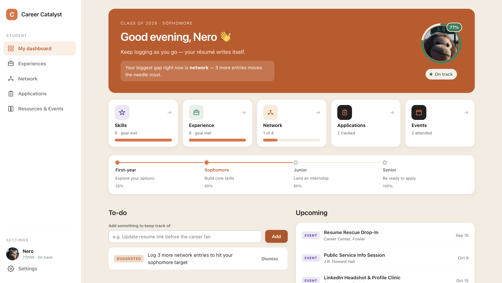
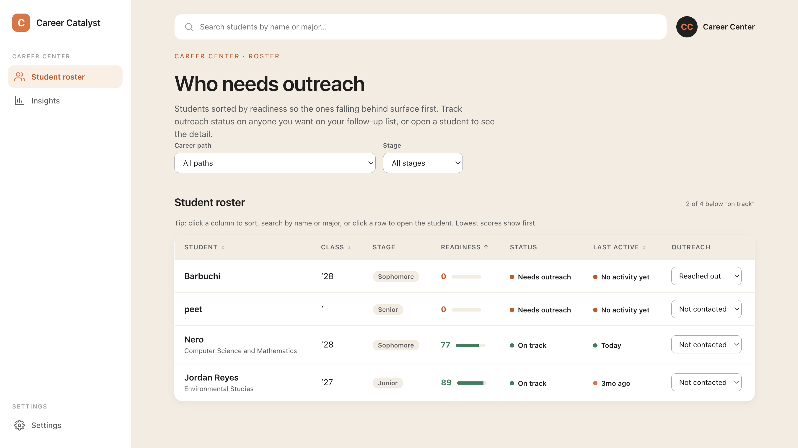

# Career Catalyst

A career-readiness tool for **Lewis & Clark College**, built for the Career Catalyst Challenge.

L&C students can't see their own career readiness — skills, experience, and professional network
— in one place, and Career Center staff have no way to spot which students need help before it's
too late. Career Catalyst puts all of it behind one **readiness score** that both the student and
the Career Center can see, growing across all four years instead of resetting every semester.

## Challenge areas addressed

| Challenge area | How Career Catalyst addresses it |
| --- | --- |
| **Experience Tracking** | The **Experiences** tab (internships, research, study abroad, leadership, volunteer work, campus involvement, and a dedicated **Projects** subtab) is one running log instead of scattered notes. |
| **Professional Networking** | The **Network** tab tracks who you met, how (mentor/faculty/alumni/recruiter/friend), a relationship-strength rating, and time-since-last-contact — plus an **Explore alumni** subtab to find new ones. |
| **Skills Development** | Skills are their own entity with growing **evidence** over time (not a static resume line), and each piece of evidence can optionally link back to the Experience/Project it came from. |
| **Career Readiness** | Applications, resources, and the readiness score live in one account instead of across Handshake, a resume doc, and memory — with a staff-facing roster so the Career Center can see who's falling behind before it's too late. |

## Try the deployed MVP site

- **Student view**: sign up with any real-looking `@lclark.edu` email — there's no verification
  beyond the domain check, so any address at that domain works for testing.
- **Staff view**: sign in with `you@lclark.edu` / `you2010` — a seeded staff account, already
  promoted to the `staff` role, so you land straight on the roster instead of a student dashboard.

## The core loop

A student logs an entry (a skill, an experience, or a professional contact) → their readiness
score recomputes instantly → the student sees their dashboard and biggest gap → Career Center
staff see a roster sorted by score, lowest first → staff move students through an outreach
workflow and drill into any student for the detail.

## Two views

- **Student**:

  - **Dashboard** — a four-year stage bar with a milestone per stage, readiness ring, five clickable
    stat cards (skills/experience/network/applications/events), upcoming deadlines & events, a
    to-do list, and a searchable timeline of everything logged.
  - **Experiences** — three subtabs: **Experiences**, **Projects**, and **Skills** (growth cards with
    evidence over time).
  - **Network** — **Your connections** (searchable, filterable by relationship) and **Explore
    alumni** (browse + save as a connection).
  - **Applications** — curated on-campus/external opportunities to explore and save, plus a
    personal tracker with deadlines, status, and company logos.
  - **Resources & Events** — Career Center services, **News** (real Career Center articles),
    **Events** (mark-attended, career-path filter), and **Resources** (resume templates + explore
    career paths).
  - **Settings** — photo, majors/minors, goal, interests, resume link, and LinkedIn.

- **Career Center staff**:

  - **Roster** — sorted by readiness (lowest first), filterable by career path and class stage, an
    **outreach status** per student (not contacted → reached out → responded → scheduled), and a
    per-student drill-in with gaps framed as talking points, their full timeline, and advising
    notes (attributed to the staff member who wrote them).
  - **Insights** — cohort-level analytics: score distribution, category strength, engagement by
    stage, and dominant career-path spread.
  - **Settings** — name and position only; no student-profile fields.

Role comes from the signed-in account (`students.role` in the database), not a UI toggle — a
student can never click into the Career Center roster, and vice versa.

## Student privacy

Staff can see enough to help, not everything a student logs. A Postgres function redacts a
student's row before it ever reaches a staff account: skill-evidence descriptions, experience
notes/organization/location/tools, and full contact details (names, emails, relationships) are
stripped server-side — staff see structured facts (titles, categories, dates, counts) only, never
a student's free text or who's in their network. See
[`redact_skills`/`redact_entries`/`staff_roster()` in `supabase/schema.sql`](./supabase/schema.sql).

## Stage-aware scoring

The readiness score isn't flat. Category targets grow across the four years, so the same entries
read as "ahead" for a first-year and "behind" for a senior. A first-year at 40 is doing great; a
senior at 40 needs outreach — and the roster shows stage so staff see the difference at a glance.

## Career paths

Skills, experiences, and contacts can be tagged with one of Lewis & Clark's real nine career paths
(Data Science/Tech/CS, Environment & Natural Sciences, Public Service/Law/Policy, and so on). The
app surfaces a student's dominant path, showing whether their work is cohering toward a direction.

## Accounts & data

Sign-in is real: email/password via Supabase Auth, gated to `@lclark.edu` addresses (checked
client-side for UX and enforced again server-side, so it can't be bypassed). Each account gets
one row in a `students` table behind Postgres row-level security — a student can only read/write
their own row; staff can read the redacted roster and update outreach status/advising notes, never
a student's own data directly. See [`supabase/schema.sql`](./supabase/schema.sql) for the full
schema and policies. The readiness score itself is never stored — it's always derived from a
student's skills/entries via a single `scoreFor()` function, so the student and staff views can
never disagree.

## Tech

Vite + React + TypeScript on the frontend, Supabase (Postgres + Auth + Storage) as the backend.
Fully static build — no server to run yourself; Supabase is the only external dependency.

## Run it

```bash
npm install
cp .env.example .env.local   # fill in your Supabase project URL + anon key
npm run dev                  # http://localhost:5173
npm run build                # production build to dist/
```

You'll also need a Supabase project with [`supabase/schema.sql`](./supabase/schema.sql) run once
in the SQL Editor (Project → SQL Editor → New query → paste → Run) before sign-up will work.

## Deploy

The frontend is a static build; Supabase is hosted separately.

- **Vercel** — import the repo; it auto-detects Vite. Add `VITE_SUPABASE_URL` and
  `VITE_SUPABASE_ANON_KEY` as environment variables in the project settings.
- **GitHub Pages** — run `npm run build`, serve the `dist/` folder, and set the same two
  `VITE_*` env vars at build time.

## Accessibility

Built to a WCAG floor from the start: skip link, semantic table with sortable headers exposed via
`aria-sort`, live-region announcements for actions, `aria-pressed`/`role="tab"` toggles, visible
focus rings, keyboard navigation, and reduced-motion support. Button/text color pairs were checked
by hand against WCAG contrast minimums (the kind of check the WebAIM contrast checker verifies).

## Design

Uses Lewis & Clark's real brand — orange `#E5703A` and black, the Pioneers identity, and the
Career Center in Fowler Student Center. Skill categories are grounded in the NACE
career-readiness competencies that college career centers actually use.

See [`CLAUDE.md`](./CLAUDE.md) for architecture decisions, scope guardrails, and the file map.

## Future plans

Scoped out for now, to keep the build focused ahead of the deadline:

- **Resume upload.** There's no backend to host a binary file, so `resumeUrl` stays a link field
  (paste a link to a PDF or Google Doc) rather than an actual upload.
- **Resume / LinkedIn generator UI.** The generation logic already exists —
  [`src/lib/generate.ts`](./src/lib/generate.ts)'s `resumeBullets()` and `linkedinBlurb()` build a
  plain-text resume and an "About" blurb purely from a student's already-logged data — but neither
  is wired into a page yet.
- **Real SSO instead of manual role assignment.** Today every sign-up becomes a `student` by
  default, and promoting an account to `staff` means editing the `role` column directly in
  Postgres. Integrating L&C's actual single sign-on would let the school's own identity provider
  tell us whether an `@lclark.edu` login belongs to a student or Career Center staff, and assign
  the right role automatically at sign-up instead of by hand.

> Demo data only. No real student information.
